# Tutorial ilustrado — Nextcloud + OnlyOffice

Capturas feitas automaticamente via Selenium contra a stack rodando em
`http://localhost:8080` (Nextcloud) e `http://localhost/` (OnlyOffice).

Usuário `bob` e grupo `equipe` criados via `occ` (script em
`scripts/occ_setup.ps1`); navegação e capturas feitas pelo
`scripts/tutorial.py` + `scripts/bob_shots.py`.

---

## 1. Tela de login

Após `docker compose -f docker-compose.windows-test.yml up -d` e ~1 min, o
Nextcloud responde em `http://localhost:8080`.

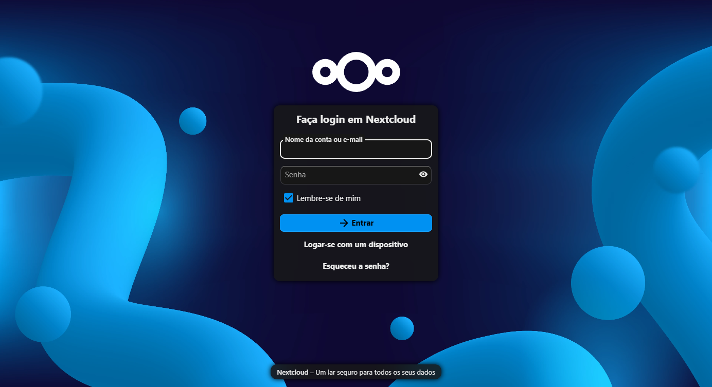

## 2. Login como admin

Credenciais vindas do compose (`NEXTCLOUD_ADMIN_USER` /
`NEXTCLOUD_ADMIN_PASSWORD`). Logo após o login, aparece o modal de
boas-vindas do Nextcloud Hub — clique em **Pular** para fechar.

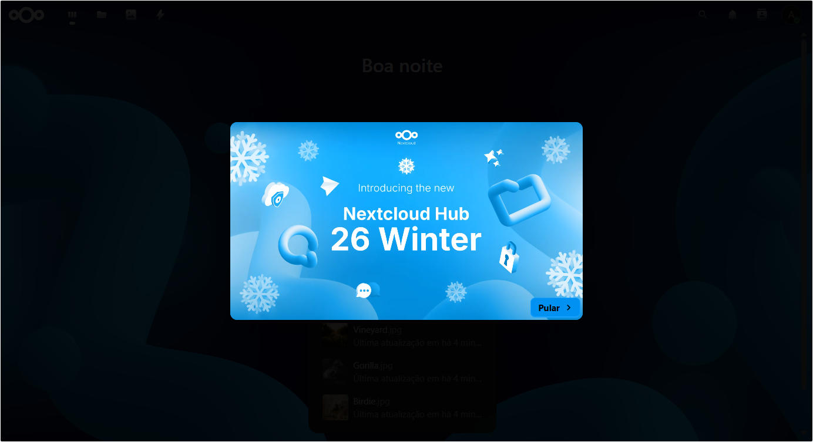

## 3. Dashboard

Sem o modal, o dashboard exibe a saudação e os arquivos sugeridos.

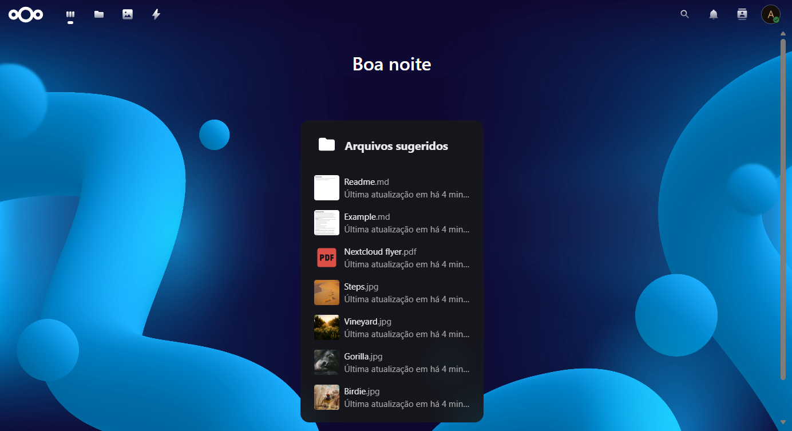

## 4. Aplicativo Arquivos

Vazio na primeira execução — é aqui que os documentos serão criados e
compartilhados.

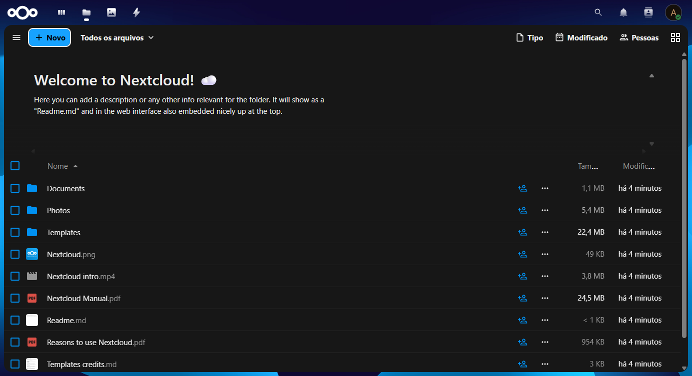

## 5. Contas — lista com Bob Silva

O usuário `bob` foi criado via `occ user:add` e atribuído ao grupo
`equipe`. Na UI de administração de contas ele aparece listado junto do
admin.

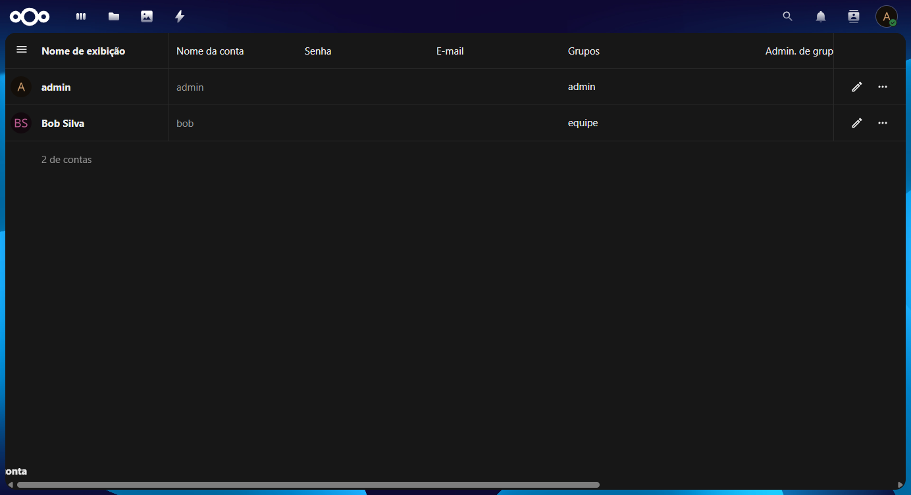

> **Alternativa via UI**: o botão **+ Nova conta** no topo da sidebar
> esquerda abre o formulário; o `+` ao lado de **Grupos** cria um novo
> grupo. Fizemos via CLI porque era mais rápido de automatizar, mas o
> fluxo manual é exatamente esse.

## 6. Filtro por grupo — equipe

Clicando em **equipe** na sidebar, a listagem mostra só os membros do
grupo. Bob aparece sozinho.

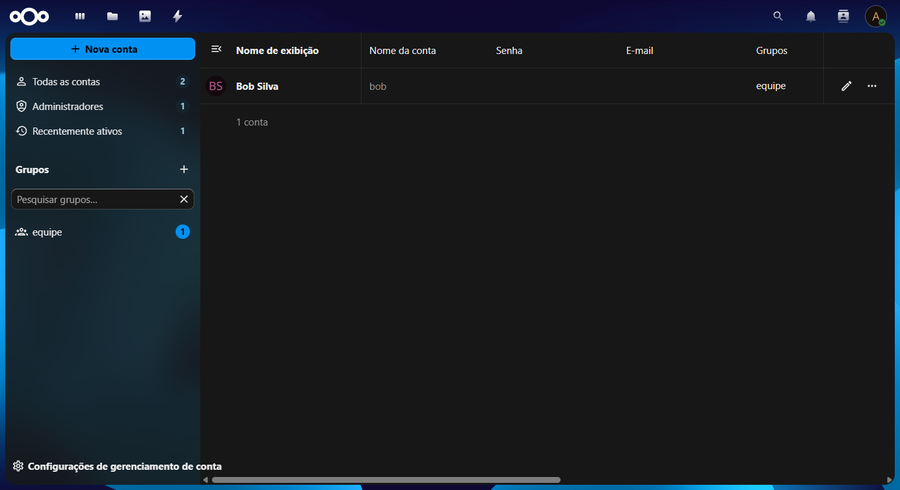

## 7. Configurações → Aplicativos

A loja de apps do Nextcloud. É daqui que se instala o connector
**ONLYOFFICE** (categoria "Escritório & texto").

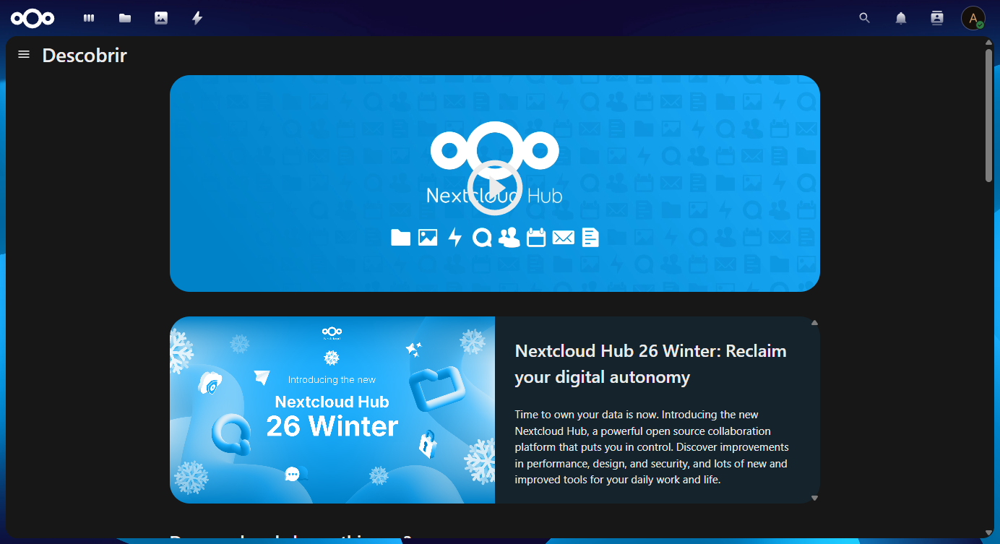

## 8. Categoria Escritório & texto

O Nextcloud mostra os dois pacotes de escritório possíveis:

- **Nextcloud Office** (Collabora) — código aberto, integração mais
  direta, compatibilidade limitada com formatos Microsoft.
- **OnlyOffice** — melhor compatibilidade com `.docx`/`.xlsx`/`.pptx`, é
  o que está rodando nesta stack.

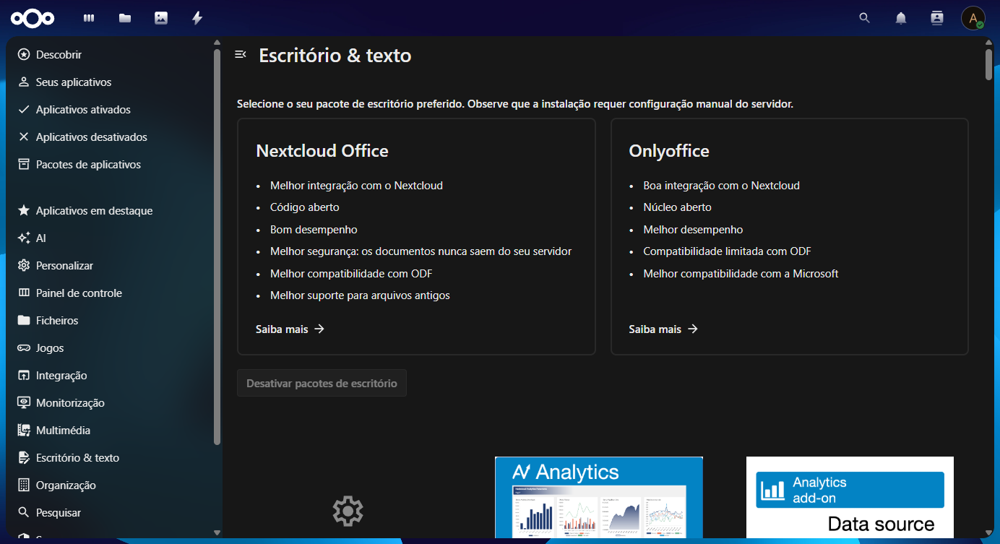

Na primeira vez, baixe e ative o **ONLYOFFICE connector**, depois vá em
**Administration settings → ONLYOFFICE** e configure:

- **Document Editing Service address**: `http://localhost/`
- **Secret key**: mesmo valor de `JWT_SECRET` do compose
  (`troque_este_segredo_jwt_bem_grande` — troque antes de usar).
- Em **Advanced server settings**:
  - *Service address for internal requests from the server*:
    `http://localhost/`
  - *Server address for internal requests from the document editing
    service*: `http://localhost:8080/`

## 9. Administração — visão geral

Painel admin com status do servidor, segurança, e-mail etc. É o hub
central de configurações do sistema.

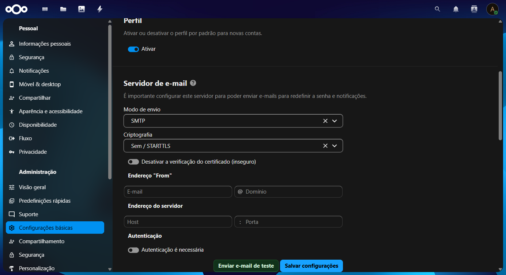

## 10. Bob logado

Logout do admin → login como `bob` (`senhaBob123!`). Mesma tela de
dashboard, agora com saudação para **Bob Silva**.

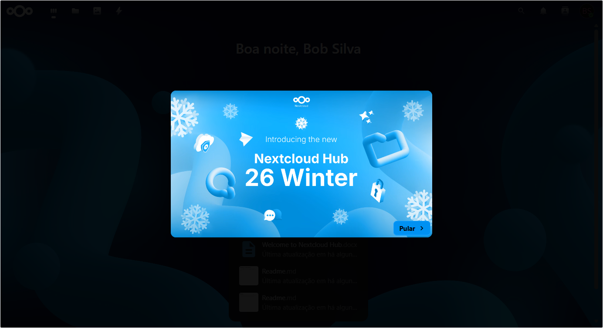

## 11. Arquivos do Bob (antes de compartilhar)

Vazio, como esperado — ainda não recebeu nenhum compartilhamento.

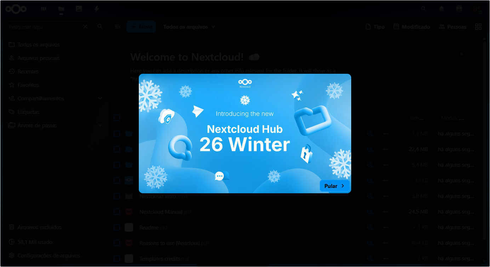

---

## Editando documentos online

### 12. Arquivo criado na listagem

Após criar `Relatorio da equipe.docx` (via **+ Novo → Novo documento** ou
via WebDAV), ele aparece na listagem de arquivos do admin.

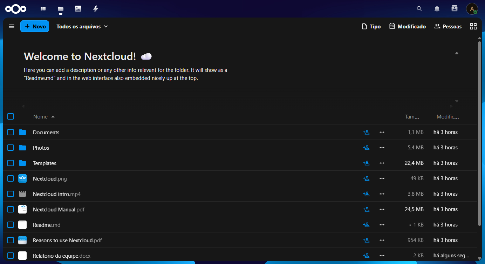

### 13. Menu "+ Novo"

O botão **+ Novo** abre as opções de criação: pastas, documentos, planilhas,
apresentações e PDFs — todos criados diretamente pelo OnlyOffice.

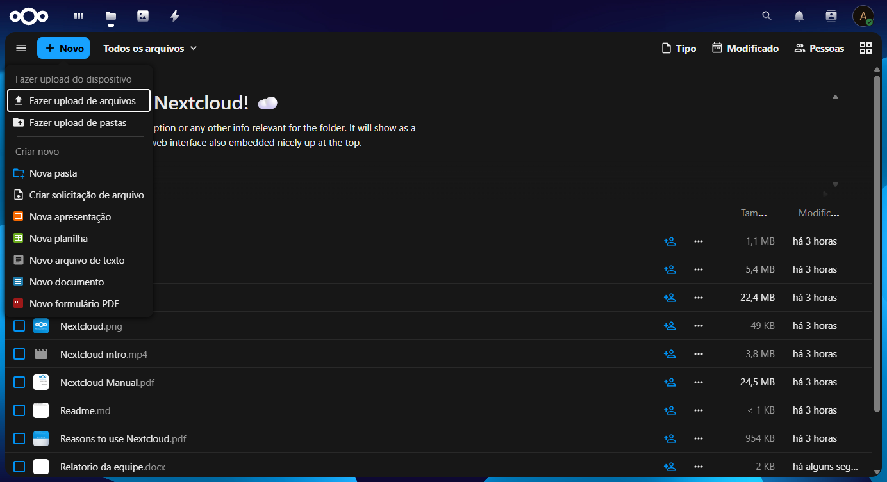

### 14–15. Editor OnlyOffice carregado

Ao clicar no `.docx`, o Nextcloud abre o editor OnlyOffice embutido em
iframe. Toolbar completa: fonte, tamanho, negrito/itálico, alinhamento,
estilos. No canto superior direito, o modo **Editando** confirma que o
documento é editável (não só leitura).


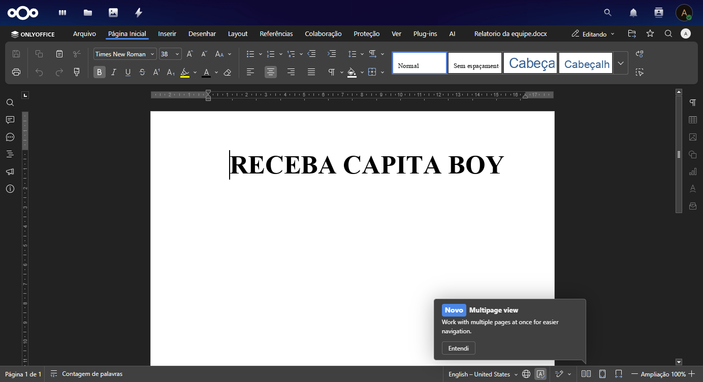

### 16. Documento em edição

O editor mostra o cursor posicionado no documento em branco, pronto para
digitação. Qualquer alteração é salva automaticamente no Nextcloud via
callback JWT.


### 17. Voltando aos Arquivos

Ao fechar o editor (botão **✕** no canto superior direito), o documento
aparece atualizado na listagem.

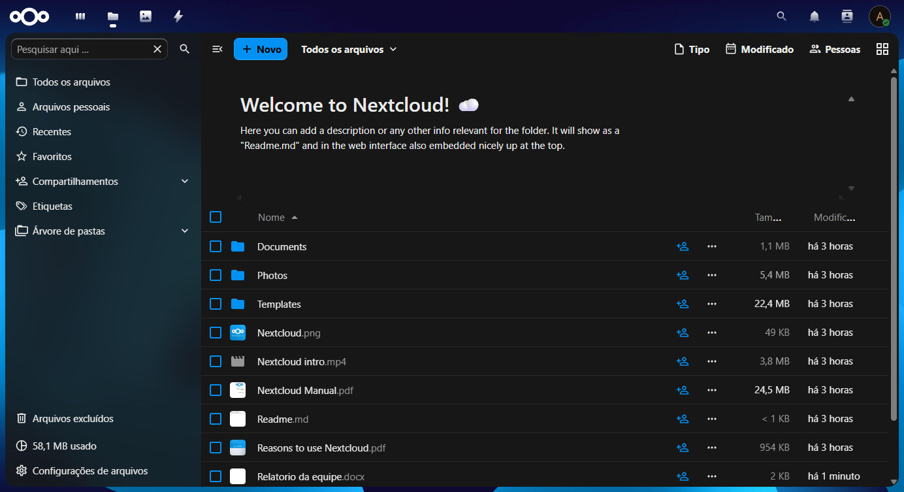

---

## Compartilhando com outro usuário

### 18–20. Sidebar de compartilhamento

Clicando no arquivo e abrindo a sidebar, a aba **Compartilhamento** permite
buscar usuários e definir permissões (leitura, edição, exclusão, re-share).


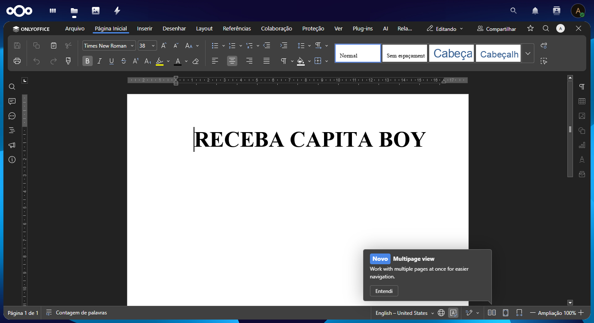

### 21. Bob vê o arquivo compartilhado

Após o admin compartilhar o documento com `bob`, ele aparece na listagem
do Bob com o badge **Compartilhado** e o avatar do remetente.

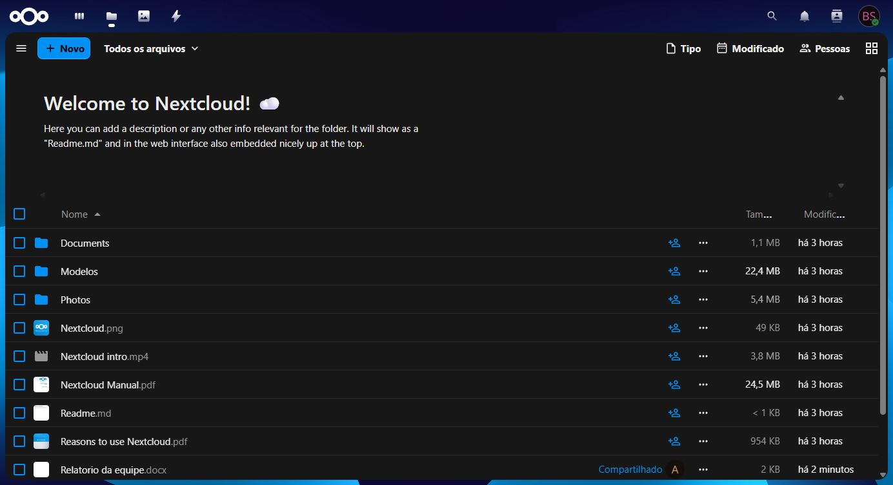

### 22. Tela "Compartilhado com você"

Na seção **Compartilhado com você**, Bob vê apenas os arquivos que outros
compartilharam com ele.

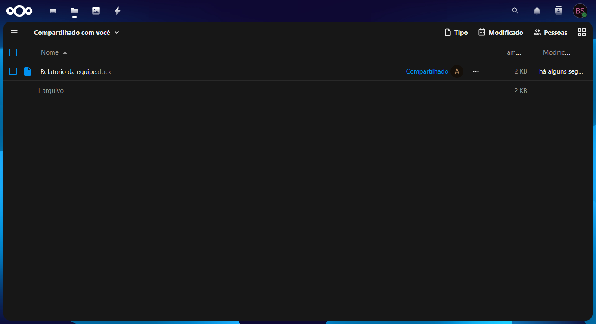

### 23. Bob editando o documento

Bob abre o `.docx` compartilhado e o editor OnlyOffice carrega em modo
**Editando** — ele tem permissão de edição, então pode modificar o
documento diretamente. Se o admin estivesse com o documento aberto ao
mesmo tempo, ambos veriam as alterações em tempo real.

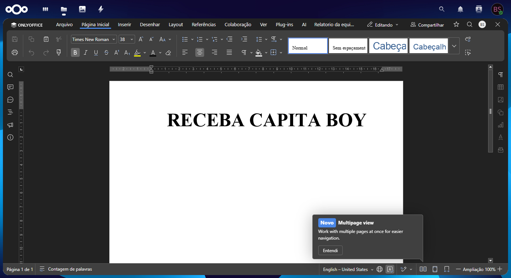

---

## Como reproduzir

```powershell
# Sobe a stack (variante Windows — usa ports em vez de host network)
docker compose -f docker-compose.windows-test.yml up -d

# Aguarda ~90 s, então cria grupo+usuário via occ
powershell -File scripts/occ_setup.ps1

# Gera screenshots 01–09
python scripts/tutorial.py

# Screenshots 10–11 (sessão nova do Bob)
python scripts/bob_shots.py

# Instala e configura o connector ONLYOFFICE
powershell -File scripts/occ_onlyoffice.ps1

# Corrige trusted_domains para callback entre containers
powershell -File scripts/fix_callback.ps1

# Screenshots 12–20 (editor, compartilhamento)
python scripts/editor_shots.py

# Compartilha o arquivo via OCS API
curl -u admin:troque_esta_senha_admin -H "OCS-APIRequest: true" \
  -d "path=Relatorio da equipe.docx&shareType=0&shareWith=bob&permissions=19" \
  "http://localhost:8080/ocs/v2.php/apps/files_sharing/api/v1/shares?format=json"

# Screenshots 21–23 (Bob vê e edita o arquivo compartilhado)
python scripts/bob_shared.py
```

## Notas sobre o ambiente

- Este tutorial foi gerado usando `docker-compose.windows-test.yml` em
  vez do `docker-compose.yml` principal, porque `network_mode: host` do
  compose principal fica preso à VM do Docker Desktop no Windows/Mac e
  não expõe em `localhost` do host. No Linux, o compose principal
  funciona sem esse workaround.
- As credenciais dos screenshots são placeholders. **Nunca** use esses
  valores em ambientes reais.
