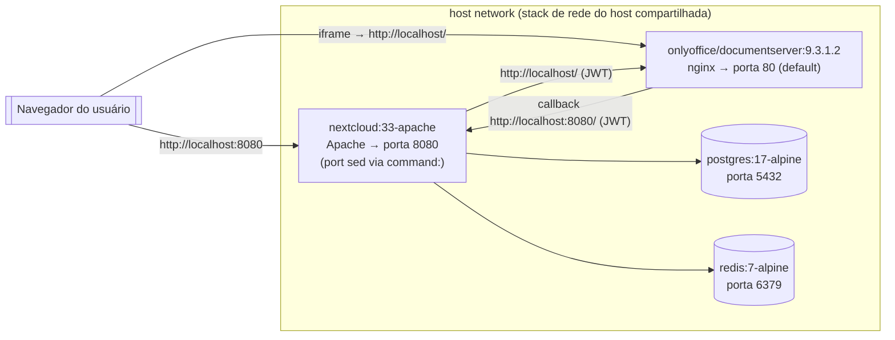

# Plan — Reestruturar repo como guia amigável Nextcloud + OnlyOffice

<!--toc:start-->

- [Plan — Reestruturar repo como guia amigável Nextcloud + OnlyOffice](#plan-reestruturar-repo-como-guia-amigável-nextcloud-onlyoffice)
  - [Context](#context)
  - [Decisões alinhadas com o usuário](#decisões-alinhadas-com-o-usuário)
  - [Arquitetura do compose simples](#arquitetura-do-compose-simples)
    - [Colisão de portas — e como ela é resolvida](#colisão-de-portas-e-como-ela-é-resolvida)
    - [Caveats a documentar no README](#caveats-a-documentar-no-readme)
  - [Versões pinadas (ambos os composes)](#versões-pinadas-ambos-os-composes)
  - [Arquivos a criar / modificar](#arquivos-a-criar-modificar)
  - [1. Novo `docker-compose.yml` (localhost, host network)](#1-novo-docker-composeyml-localhost-host-network)
  - [2. `docker-compose-coolify.yml`](#2-docker-compose-coolifyyml)
  - [3. `README.md` (estrutura, em português)](#3-readmemd-estrutura-em-português)
  - [Divisão entre ambiente remoto e local](#divisão-entre-ambiente-remoto-e-local)
  - [Verificação end-to-end (checklist para o ambiente local)](#verificação-end-to-end-checklist-para-o-ambiente-local)
  - [Critérios de aceitação](#critérios-de-aceitação)
  - [Riscos](#riscos)
  <!--toc:end-->

**Repo**: `im-alexandre/nextcloud-onlyoffice-coolify`

**Estado atual verificado** (via raw GitHub): o repo tem exatamente 2 arquivos: `docker-compose.yml` (Coolify-wired, domínios `cloud.drg.ink`/`docs.drg.ink`, labels Traefik, CA montada, JWT desabilitado, senhas em plain) e `README.md` (basicamente vazio — só o título `# nextcloud-onlyoffice-coolify`). **Não existe `CLAUDE.md`** — o plano não toca nele.

## Context

O repo alvo hoje tem um único `docker-compose.yml` amarrado a Coolify: rede externa `coolify`, labels Traefik, domínios `cloud.drg.ink`/`docs.drg.ink`, CA interna do Coolify montada nos containers. Um amigo do usuário quer auto-hospedar Nextcloud + OnlyOffice e precisa de um ponto de partida em localhost, sem proxy reverso, antes de decidir se expõe publicamente.

A reestruturação faz três coisas:

1. Substitui o `docker-compose.yml` por uma versão localhost simples (portas expostas no host, sem rede externa, sem Traefik).

2. Preserva o compose Coolify atual como `docker-compose-coolify.yml` — só renomeia, com duas mudanças mínimas: bump das imagens para as versões pinadas abaixo, e remoção do atributo obsoleto `version: "3.8"` do topo (compose v2 ignora mas emite warning).

3. Escreve `README.md` (hoje só o título) como um guia em português cobrindo instalação, ativação do connector ONLYOFFICE, gestão de usuários/grupos, compartilhamento, backup e atualização.

## Decisões alinhadas com o usuário

- **Alvo**: localhost. Nextcloud em `http://localhost:8080`, OnlyOffice em `http://localhost/` (porta 80 do host).

- **Rede**: `network_mode: host` em todos os serviços (escolhido pelo usuário).
  Justificativa: o usuário não quer nomes de serviço Docker (`http://onlyoffice/`) nem `host.docker.internal` no connector — todas as URLs têm que ser `http://localhost:<porta>`. Isso só é viável se Nextcloud e OnlyOffice compartilharem a stack de rede do host.

- **Sem proxy reverso** no compose simples. README aponta para `docker-compose-coolify.yml` como exemplo de produção com Traefik/TLS.

- **JWT ligado** por padrão com placeholder. README explica que o mesmo segredo vai no connector do Nextcloud.

- **README cobre**: instalação, connector, usuários/grupos, permissões, backup, atualização.

## Arquitetura do compose simples



Ponto-chave: com `network_mode: host`, **todos** os 4 containers compartilham a stack de rede do host. `localhost` dentro de qualquer um deles aponta pro host, não pro próprio container. Isso permite que Nextcloud alcance OnlyOffice via `http://localhost/` e vice-versa, sem nomes de DNS Docker nem `host.docker.internal`.

### Colisão de portas — e como ela é resolvida

Por default, Nextcloud (Apache) e OnlyOffice (nginx) ambos escutam em 80.
Em host mode só um pode ficar na 80. Solução: um pequeno `sed` no `command:` do Nextcloud reescreve `/etc/apache2/ports.conf` e `/etc/apache2/sites-enabled/000-default.conf` de 80 → 8080 **antes** do `apache2-foreground`.

OnlyOffice fica na porta 80 (default), Nextcloud na 8080.

Nenhum dos dois precisa de imagem custom ou Dockerfile extra.

Resultado visível no connector: os campos "Document Editing Service address" e "Advanced server settings" usam só `http://localhost/` (OnlyOffice) e `http://localhost:8080/` (Nextcloud callback).

Zero `http://onlyoffice/`, zero `host.docker.internal`.

### Caveats a documentar no README

- **Porta 80 do host precisa estar livre** (OnlyOffice vai bindar nela). Se o usuário tem apache/nginx/caddy rodando localmente, precisa parar antes de subir a stack.

- **Docker Desktop (Mac/Windows)**: `network_mode: host` só é suportado a partir do Docker Desktop 4.29 (2024) e precisa ser habilitado explicitamente em Settings → Resources → Network. No Linux funciona sem ajustes.

- **`db` e `redis` em host mode** expõem 5432/6379 direto no host (localhost-only no Linux por default). Para uso só local em máquina de teste é aceitável; em produção jamais.

- JWT secret: idêntico dos dois lados (`JWT_SECRET` no compose == "Secret key" no connector), senão o editor não carrega.

## Versões pinadas (ambos os composes)

| Serviço    | Hoje no repo                       | Alvo                                | Motivo                                                         |
| ---------- | ---------------------------------- | ----------------------------------- | -------------------------------------------------------------- |
| Nextcloud  | `nextcloud:29-apache`              | `nextcloud:33-apache`               | 33 é a major estável atual; 29 saiu de suporte.                |
| PostgreSQL | `postgres:16-alpine`               | `postgres:17-alpine`                | 17 suportado pela 33; mais conservador que o 18 "recommended". |
| Redis      | `redis:7-alpine`                   | `redis:7-alpine`                    | Mantém — 7 é LTS e suficiente para cache.                      |
| OnlyOffice | `onlyoffice/documentserver:latest` | `onlyoffice/documentserver:9.3.1.2` | Fixa tag — builds reprodutíveis.                               |

Compatibilidade verificada (fontes no rascunho original): Nextcloud 33 suporta PG 14–18 e PHP 8.3–8.5; connector ONLYOFFICE v10 é compatível com Nextcloud 33 e Docs 9.3. Connector é instalado pela UI — não entra no compose.

Como é instalação nova (volume `nextcloud_data` nasce vazio), não há migração de major em jogo.

## Arquivos a criar / modificar

| Arquivo | Ação |

|---|---|

| `docker-compose-coolify.yml` | **Novo** — cópia do `docker-compose.yml` atual, trocando apenas as tags de imagem pelas versões pinadas, removendo `version: "3.8"` do topo. Nenhuma outra mudança: mantém rede externa `coolify`, labels Traefik, domínios `cloud.drg.ink`/`docs.drg.ink`, CA interna montada nos dois containers (inclusive o mount duplo em `/var/www/onlyoffice/Data/certs/coolify-ca.crt`), JWT desabilitado, senhas em plain como estão. |

| `docker-compose.yml` | **Reescrito do zero** — versão localhost (estrutura abaixo). |

| `README.md` | **Escrito do zero** (hoje só tem o título) — guia em português (seções abaixo). |

Ordem de execução: (1) criar `docker-compose-coolify.yml` a partir do atual

com bump de versões, (2) reescrever `docker-compose.yml` para a versão

localhost, (3) escrever `README.md`.

## 1. Novo `docker-compose.yml` (localhost, host network)

```yaml
services:
  db:
    image: postgres:17-alpine

    network_mode: host

    restart: unless-stopped

    environment:
      POSTGRES_DB: nextcloud

      POSTGRES_USER: nextcloud

      POSTGRES_PASSWORD: troque_esta_senha_db

    volumes:
      - db_data:/var/lib/postgresql/data

  redis:
    image: redis:7-alpine

    network_mode: host

    restart: unless-stopped

    command: ["redis-server", "--save", "", "--appendonly", "no"]

    volumes:
      - redis_data:/data

  nextcloud:
    image: nextcloud:33-apache

    network_mode: host

    restart: unless-stopped

    depends_on: [db, redis]

    environment:
      POSTGRES_HOST: 127.0.0.1

      POSTGRES_DB: nextcloud

      POSTGRES_USER: nextcloud

      POSTGRES_PASSWORD: troque_esta_senha_db

      REDIS_HOST: 127.0.0.1

      NEXTCLOUD_ADMIN_USER: admin

      NEXTCLOUD_ADMIN_PASSWORD: troque_esta_senha_admin

      NEXTCLOUD_TRUSTED_DOMAINS: localhost

      PHP_UPLOAD_LIMIT: 1024M

      PHP_MEMORY_LIMIT: 1024M

    volumes:
      - nextcloud_data:/var/www/html

    # Muda a porta do Apache de 80 para 8080 antes de iniciar, para não

    # colidir com o OnlyOffice (que fica na 80). /entrypoint.sh roda antes

    # deste CMD e exec'a ele no final.

    command:
      - bash

      - -c

      - |

        sed -ri 's/Listen 80/Listen 8080/' /etc/apache2/ports.conf

        sed -ri 's/<VirtualHost \*:80>/<VirtualHost *:8080>/' /etc/apache2/sites-enabled/000-default.conf

        exec apache2-foreground

  onlyoffice:
    image: onlyoffice/documentserver:9.3.1.2

    network_mode: host

    restart: unless-stopped

    environment:
      JWT_ENABLED: "true"

      JWT_SECRET: troque_este_segredo_jwt_bem_grande

      JWT_HEADER: Authorization

    volumes:
      - onlyoffice_data:/var/www/onlyoffice/Data

      - onlyoffice_log:/var/log/onlyoffice

      - onlyoffice_lib:/var/lib/onlyoffice

volumes:
  db_data:

  redis_data:

  nextcloud_data:

  onlyoffice_data:

  onlyoffice_log:

  onlyoffice_lib:
```

Pontos-chave:

- `network_mode: host` em **todos** os 4 serviços. Compose não precisa de

  rede declarada; não há `ports:` (ignorados em host mode).

- Nextcloud fala com db/redis via `127.0.0.1` (mesma stack de rede).

- Apache do Nextcloud realocado para 8080 via sed no `command:`. O

  `/entrypoint.sh` da imagem Nextcloud faz `exec "$@"` no final, então

  nosso bash roda depois de toda a setup do Nextcloud e antes do

  `apache2-foreground`. Nenhum Dockerfile custom.

- OnlyOffice fica na 80 default — nenhuma mudança na imagem.

- JWT ligado com placeholder claramente marcado.

- Volumes extras para logs/cache do OnlyOffice evitam erros de permissão

  entre restarts.

- `NEXTCLOUD_TRUSTED_DOMAINS: localhost` cobre o caso padrão.

## 2. `docker-compose-coolify.yml`

Cópia do `docker-compose.yml` atual com apenas:

- bumps de imagem da tabela acima (`nextcloud:33-apache`, `postgres:17-alpine`,

  `onlyoffice/documentserver:9.3.1.2`; redis mantém `7-alpine`);

- remoção do `version: "3.8"` (obsoleto em compose v2).

Zero mudança estrutural: rede `coolify` externa, labels Traefik, labels

`traefik.enable=false` em db/redis, envs de `OVERWRITEHOST`/`APACHE_SERVER_NAME`

com `cloud.drg.ink`, mount da CA interna em `nextcloud` e os **dois** mounts

da CA em `onlyoffice` (`/etc/ssl/certs/coolify-ca.crt` e

`/var/www/onlyoffice/Data/certs/coolify-ca.crt`), `JWT_ENABLED: "false"`,

senhas em plain — tudo preservado. É a referência "como o usuário realmente

roda em produção".

## 3. `README.md` (estrutura, em português)

1. **O que é** — duas frases: Nextcloud (file sync + colaboração) + OnlyOffice

   (editor no browser) rodando juntos via Docker.

2. **Conceitos em 2 minutos** — o que cada serviço faz, como se conversam

   (Nextcloud exibe arquivos, OnlyOffice renderiza editor em iframe,

   comunicação via JWT). Reusar o diagrama deste plano.

3. **Pré-requisitos**:
   - Docker + Docker Compose.

   - **Porta 80 e 8080 do host livres** (OnlyOffice vai ocupar a 80,

     Nextcloud a 8080). Parar serviços como apache/nginx locais antes.

   - No Docker Desktop (Mac/Windows): habilitar host networking em

     Settings → Resources → Network. Linux funciona sem ajuste.

4. **Subindo pela primeira vez** — `docker compose up -d`, aguardar 1–2 min,

   `http://localhost:8080`, login com credenciais do env (sem wizard porque

   `NEXTCLOUD_ADMIN_USER`/`PASSWORD` pré-configuram).

5. **Ativando o OnlyOffice no Nextcloud**:
   - Apps → procurar "ONLYOFFICE" → Install.

   - Admin settings → ONLYOFFICE:
     - _Document Editing Service address_: `http://localhost/`

     - _Secret key_: o mesmo valor de `JWT_SECRET` do compose.

   - **Advanced server settings**:
     - \*Document Editing Service address for internal requests from the

       server\*: `http://localhost/`

     - \*Server address for internal requests from the document editing

       service\*: `http://localhost:8080/`

   - Salvar. Todas as URLs são `localhost` — nada de nome de serviço

     Docker ou `host.docker.internal`. Isso funciona porque os containers

     estão em `network_mode: host` e compartilham a stack de rede do host.

6. **Usuários e grupos** — feito **pela UI do Nextcloud**, não via CLI:
   - Menu do topo direito (avatar) → _Users_.

   - _New user_: username, senha inicial, email, quota, grupos.

   - _Groups_ (sidebar): criar grupo, arrastar usuários.

   - Quota por usuário ajustada na linha do usuário na mesma tela.

7. **Compartilhamento e permissões** — share button → usuário/grupo/link

   público com senha+expiração; read / edit / create / delete / reshare.

8. **Backup** — parar stack, para cada volume:

   `docker run --rm -v <vol>:/data -v $PWD:/backup alpine tar czf /backup/<vol>.tgz -C /data .`

   (volumes: `db_data`, `nextcloud_data`, `onlyoffice_data`). Restore

   inverso.

9. **Atualização** — `docker compose pull && docker compose up -d`. Nextcloud

   auto-upgrade no start. Cuidado com saltos de major (ir um de cada vez).

10. **Para produção** — aponta `docker-compose-coolify.yml` como exemplo

    real. Checklist: trocar todas as senhas, HTTPS obrigatório, ajustar

    `NEXTCLOUD_TRUSTED_DOMAINS`, `OVERWRITEHOST`, `OVERWRITEPROTOCOL`.

11. **Troubleshooting**:
    - "OnlyOffice não abre" → JWT idêntico dos dois lados.

    - "Untrusted domain" → adicionar ao `NEXTCLOUD_TRUSTED_DOMAINS` (env var,

      ou `occ config:system:set trusted_domains 1 --value=...`).

    - "Falha em upload grande" → `PHP_UPLOAD_LIMIT` / `PHP_MEMORY_LIMIT`.

## Divisão entre ambiente remoto e local

- **Remoto (esta sessão)**: só escreve arquivos (`docker-compose.yml`,

  `docker-compose-coolify.yml`, `README.md`), abre PR. **Não executa**

  `docker compose up` — não há Docker disponível aqui e o usuário faz o

  teste na própria máquina.

- **Local (máquina do usuário)**: clona/atualiza o branch, roda a stack,

  valida pela UI seguindo o checklist abaixo.

## Verificação end-to-end (checklist para o ambiente local)

Rodar na ordem, **na máquina do usuário**:

1. Confirmar portas 80 e 8080 livres no host (`ss -ltnp | grep -E ':80 |:8080 '`

   deve retornar vazio).

2. `docker compose up -d`.

3. `docker compose logs -f nextcloud` até ver "resuming normal operations".

4. `curl -I http://localhost:8080` → HTTP/1.1 302 ou 200 (Nextcloud).

5. `curl http://localhost/healthcheck` → `true` (OnlyOffice).

6. Browser → `http://localhost:8080` → login com credenciais do env → cai

   direto no dashboard (sem wizard).

7. Apps → Install ONLYOFFICE → Admin → ONLYOFFICE:
   - Endereço: `http://localhost/`

   - Secret: mesmo valor do `JWT_SECRET`

   - Advanced → Nextcloud callback: `http://localhost:8080/`

   - Advanced → OnlyOffice internal: `http://localhost/`

   - Salvar sem erro.

8. Criar `teste.docx` no Files → abrir → editor carrega em iframe → digitar →

   fechar → reabrir: texto persistiu (confirma que o callback OnlyOffice →

   Nextcloud via `http://localhost:8080/` funcionou).

9. UI → _Users_ → criar user `bob` pela interface (não via CLI) → logar

   como admin → compartilhar `teste.docx` com `bob` → logar como `bob` →

   arquivo aparece em "Shared with you".

10. `docker compose down && docker compose up -d` → user `bob`, arquivo e

    config do connector persistem.

11. Revisão manual do README: todos os blocos de código copy-pasteable, links

    internos batendo, aviso de "troque todas as senhas" destacado no topo da

    seção de instalação.

## Critérios de aceitação

**Estrutura**

- [ ] `docker-compose.yml` usa `network_mode: host` em todos os 4 serviços,

      sem `ports:`, sem labels Traefik, sem `networks:` declarado.

- [ ] Nextcloud tem o `command:` com os dois `sed` + `exec apache2-foreground`

      que realocam o Apache para 8080.

- [ ] `docker-compose-coolify.yml` preserva a config Coolify (rede `coolify`,

      labels Traefik, domínios `cloud.drg.ink`/`docs.drg.ink`, CA montada).

- [ ] `README.md` em português com todas as 11 seções listadas.

**Versões pinadas (ambos os composes)**

- [ ] `nextcloud:33-apache`

- [ ] `postgres:17-alpine`

- [ ] `redis:7-alpine`

- [ ] `onlyoffice/documentserver:9.3.1.2`

**Funcional** (itens 1–8 da verificação passando)

**Qualidade do README**

- [ ] Pré-requisitos deixam explícito: portas 80 e 8080 livres + host

      networking habilitado no Docker Desktop (Mac/Win).

- [ ] Instruções do connector usam **apenas** `http://localhost/` e

      `http://localhost:8080/` — nenhuma menção a `http://onlyoffice/` ou

      `host.docker.internal`.

- [ ] Aviso de "troque `JWT_SECRET`, `POSTGRES_PASSWORD`,

      `NEXTCLOUD_ADMIN_PASSWORD`" antes de qualquer uso.

- [ ] Backup com comandos copy-pasteable para `db_data`, `nextcloud_data`,

      `onlyoffice_data`.

- [ ] Troubleshooting com os 3 erros da seção 11.

## Riscos

- **Port 80 ocupada no host**: causa de falha mais comum no primeiro

  `docker compose up`. README precisa citar como checar (`ss -ltnp`) e o que

  parar (apache2, nginx, caddy).

- **Docker Desktop em Mac/Windows**: `network_mode: host` é uma feature

  recente (Docker Desktop 4.29+, 2024) e não é default. Se o amigo estiver

  em Mac/Win com Desktop antigo, o compose não vai funcionar. README deve

  avisar para atualizar e habilitar a opção.

- **Sed frágil**: o `command:` do Nextcloud faz substituições em

  `/etc/apache2/ports.conf` e `000-default.conf`. Se a imagem Nextcloud mudar

  a estrutura desses arquivos numa futura major, o sed para de funcionar

  silenciosamente (Apache iniciaria na porta errada). Pinnar

  `nextcloud:33-apache` (não `:latest`) mitiga; README documenta o workaround

  para futuros leitores saberem onde olhar se quebrar.

- **db/redis em host mode expõem portas no host**: 5432 e 6379 ficam

  reachable em `localhost`. Em máquina de testes isolada tudo bem; README

  avisa para não replicar essa config em produção.

- **JWT mismatch**: causa nº 1 de "Document Server não carrega". Enfatizar

  copiar exatamente o mesmo secret.

- **HTTP puro**: mixed content / cookies podem reclamar em alguns browsers.

  OK para teste local; README avisa que não escala para uso real.
